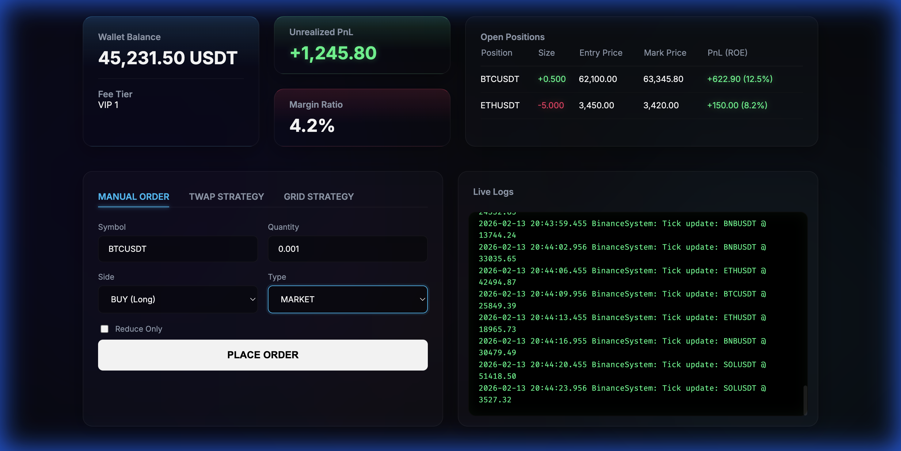

# Zenith - Binance Futures Pro
A professional algorithmic trading bot for Binance Futures.
Public URL to test it out yourself: https://zenith-ujbr.onrender.com



Zenith allows you to place `MARKET` and `LIMIT` orders on Binance Futures Testnet (USDT-M) with a premium web UI and algorithmic strategies.

## Features
- Places `BUY` and `SELL` orders
- Supports `MARKET` and `LIMIT`
- Validates CLI input
- Structured code with separate API client and CLI layer
- Logs API requests/responses/errors to `binance_bot.log`
- Handles invalid input, API failures, and network failures

## Setup
1. Create a Binance Futures Testnet account and generate API credentials.
2. Install dependencies:
   ```bash
   python3 -m venv .venv
   source .venv/bin/activate
   pip install -r requirements.txt
   ```
3. Configure credentials:
   ```bash
   cp .env.example .env
   # edit .env with your BINANCE_API_KEY / BINANCE_API_SECRET
   ```

## Usage
All requests go to:
`https://testnet.binancefuture.com`

### Market order
```bash
python main.py --symbol BTCUSDT --side BUY --type MARKET --quantity 0.001
```

### Limit order
```bash
python main.py --symbol BTCUSDT --side SELL --type LIMIT --quantity 0.001 --price 120000
```

## Output
The CLI prints:
- order request summary
- order response details (`orderId`, `status`, `executedQty`, `avgPrice` if available)
- success/failure message

## Log File Examples

All API requests and responses are logged to `binance_bot.log`. Here are examples of successful orders:

### MARKET Order Log
```
2026-02-13 00:02:24,712 | INFO | BinanceFuturesClient | API request | method=POST url=https://testnet.binancefuture.com/fapi/v1/order params={'symbol': 'BTCUSDT', 'side': 'BUY', 'type': 'MARKET', 'quantity': '0.002', 'timestamp': 1770921144712, 'recvWindow': 5000, 'newOrderRespType': 'RESULT'}

2026-02-13 00:02:25,653 | INFO | BinanceFuturesClient | API response | status_code=200 body={'orderId': 12220679314, 'symbol': 'BTCUSDT', 'status': 'FILLED', 'clientOrderId': 'Oca58S10NDHCfF3GtgzvIa', 'price': '0.00', 'avgPrice': '65103.40000', 'origQty': '0.002', 'executedQty': '0.002', 'cumQty': '0.002', 'cumQuote': '130.20680', 'timeInForce': 'GTC', 'type': 'MARKET', 'reduceOnly': False, 'closePosition': False, 'side': 'BUY', 'positionSide': 'BOTH', 'stopPrice': '0.00', 'workingType': 'CONTRACT_PRICE', 'priceProtect': False, 'origType': 'MARKET', 'priceMatch': 'NONE', 'selfTradePreventionMode': 'EXPIRE_MAKER', 'goodTillDate': 0, 'updateTime': 1770921145559}
```

### LIMIT Order Log
```
2026-02-13 00:02:28,058 | INFO | BinanceFuturesClient | API request | method=POST url=https://testnet.binancefuture.com/fapi/v1/order params={'symbol': 'BTCUSDT', 'side': 'SELL', 'type': 'LIMIT', 'quantity': '0.002', 'timestamp': 1770921148058, 'recvWindow': 5000, 'newOrderRespType': 'RESULT', 'price': '100000', 'timeInForce': 'GTC'}

2026-02-13 00:02:28,459 | INFO | BinanceFuturesClient | API response | status_code=200 body={'orderId': 12220680247, 'symbol': 'BTCUSDT', 'status': 'NEW', 'clientOrderId': '6D8LVBouaeCzZjtiBTZ4Q6', 'price': '100000.00', 'avgPrice': '0.00', 'origQty': '0.002', 'executedQty': '0.000', 'cumQty': '0.000', 'cumQuote': '0.00000', 'timeInForce': 'GTC', 'type': 'LIMIT', 'reduceOnly': False, 'closePosition': False, 'side': 'SELL', 'positionSide': 'BOTH', 'stopPrice': '0.00', 'workingType': 'CONTRACT_PRICE', 'priceProtect': False, 'origType': 'LIMIT', 'priceMatch': 'NONE', 'selfTradePreventionMode': 'EXPIRE_MAKER', 'goodTillDate': 0, 'updateTime': 1770921148395}
```

**Key Differences:**
- **MARKET orders**: Execute immediately (`status: 'FILLED'`) at the best available price (`avgPrice` is populated immediately)
- **LIMIT orders**: Remain open (`status: 'NEW'`) until price reaches the specified limit (`avgPrice: '0.00'` until filled)

## Efficiency Tools
A collection of shell scripts is available in `scripts/` to make trading faster and easier.

### 1. Quick Aliases
Save typing by using short commands like `btc-buy 0.001` or `btc-limit-sell 0.001 50000`.
```bash
source scripts/aliases.sh
# usage: btc-buy <quantity> [symbol]
# usage: btc-limit-buy <quantity> <price> [symbol]
```

### 2. Live Monitoring
Watch the bot's log file in real-time to catch errors or confirmations immediately.
```bash
./scripts/monitor.sh
```

### 3. Bulk Trading Example
See `scripts/bulk_order.sh` for an example of how to chain commands for complex strategies (e.g., Buy then immediately set a Limit Sell).
```bash
./scripts/bulk_order.sh
```

```bash
./scripts/bulk_order.sh
```

## Advanced Usage

### Interactive Mode
Launch the interactive wizard to place orders and run strategies via menus.
```bash
python interactive.py
```

### Algorithmic Strategies
- **TWAP (Time-Weighted Average Price)**: Split a large order into smaller chunks over time.
- **Grid Trading**: Place multiple buy/sell orders at fixed intervals.
*Accessible via the Interactive Mode menu.*

### Web Dashboard
Start the lightweight web UI to place orders and view logs from your browser.
```bash
python web_api.py
```
Open [http://localhost:8000](http://localhost:8000) in your browser.

### Professional Features
The Web Dashboard now includes:
- **Risk Dashboard**: View Real-time Balance, Unrealized PnL, and Margin Ratio.
- **Position Management**: Track open positions with live PnL, Entry Price, and Liquidation Price.
- **Advanced Order Controls**:
    - **Reduce Only**: Ensure orders only close positions.
    - **Stop Loss / Take Profit**: Set trigger prices for advanced risk management.
- **Sentiment Analysis** 🆕: AI-powered market intelligence using local LLM
    - Scrapes crypto news, Reddit, and Twitter/X for your trading pairs
    - Generates real-time Sentiment Score (0-100: Bearish → Neutral → Bullish)
    - Uses llama3.1:8b via Ollama for intelligent analysis
    - Integrates with strategies: pause trading when sentiment drops
    - Live dashboard display with color-coded scores

### Sentiment Analysis Setup
```bash
# 1. Ensure Ollama is running with llama3.1:8b
ollama list

# 2. (Optional) Configure Reddit API for social sentiment
# See REDDIT_API_SETUP.md for instructions

# 3. Start the web server (sentiment worker starts automatically)
python web_api.py
```

Sentiment scores update every 15-30 minutes. View on the dashboard or use in strategies:
```python
# Example: TWAP with sentiment guard
strategy = TWAPStrategy(
    client, "BTCUSDT", "BUY", 1.0, 3600, 12,
    min_sentiment_score=50,  # Pause if sentiment < 50
    pause_on_bearish=True
)
```

## Project Structure
- `main.py`: CLI argument parsing and command flow
- `interactive.py`: Interactive CLI with menus
- `web_api.py`: FastAPI backend and Web UI
- `binance_bot/client.py`: signed REST API client for Binance Futures Testnet
- `binance_bot/strategies/`: TWAP and Grid strategy implementations
- `binance_bot/validators.py`: user input normalization and validation
- `binance_bot/config.py`: environment config loading
- `binance_bot/logging_config.py`: file + console logging setup
- `binance_bot/exceptions.py`: app-specific exceptions
